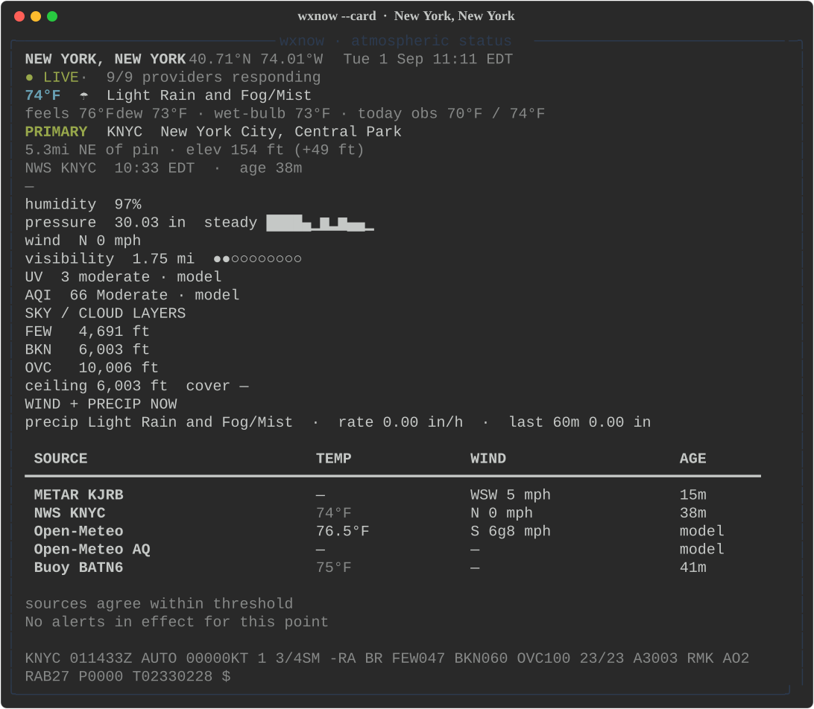

# wxnow

**A terminal instrument panel for the atmosphere as it is.**

Multiple sources. Station-honest. Zero forecast.

`wxnow` is a now-console, not a brochure. It races METAR, NWS station observations, and an Open-Meteo nowcast for one point on Earth — then shows the disagreement instead of averaging it away. There is no 7-day strip. Recent context is the last hours of *observations*.

```
wxnow "New York, NY"
```



<p align="center"><em>Live capture · New York, NY · downtown METAR KJRB, 0.8 mi from the pin. METAR 76°F, NWS 74°F, Open-Meteo 72.3°F — shown, not averaged.</em></p>

```
wxnow "Fort Myers, FL"
```


## Why it exists

City-level weather is a lie. The station is the truth.

Most terminal weather apps pick one number and dress it up: a model grid, a “feels like,” a chance of rain this afternoon. `wxnow` does the opposite.

- **Observations over models.** METAR and NWS first. Open-Meteo is labeled `nowcast` / `model`, never wearing an observation badge.
- **Disagreement is the product.** If downtown New York is 76°F, LaGuardia 75°F, and JFK 72°F, you see all three. Nothing is blended into “the temperature.”
- **Freshness is first-class.** Age sits next to every reading. Stale cells dim. A cache hit from ten minutes ago does not pretend to be live.
- **No forecast on the default path.** Not hidden behind a toggle. Not in the mosaic. Not in the radar. Radar is the *current* frame plus its age — not a loop of what’s coming.

If there is no official station within 40 km you will see: *No station within 40 km. Showing model nowcast.*

## In action

Same engine, several skins. Default on a tty is the full-screen TUI. `enter` opens the source matrix (every provider, every field, observation history only). `w` opens a watch mosaic of pinned places — downtown, JFK, LaGuardia, and Newark were 76°F / 72°F / 75°F / 75°F on this capture.

```bash
wxnow --card --units imperial "New York, NY"
wxnow --mosaic KJFK,KLGA,KEWR
wxnow --compare KJFK,KLGA
```

Recapture docs shots with `python scripts/capture_screenshots.py` (writes SVG + PNG under `docs/screenshots/`).

## Install

Python 3.11+. No API key for the happy path.

```bash
git clone https://github.com/jonathanfrei/wxnow.git
cd wxnow
python3 -m venv .venv
source .venv/bin/activate
pip install -e .
wxnow "New York, NY"
```

To run from any directory, put the venv script on your PATH:

```bash
ln -sfn "$(pwd)/.venv/bin/wxnow" ~/.local/bin/wxnow
```

## Use

```bash
wxnow                         # TUI (config default, else IP guess — labeled)
wxnow "New York, NY"          # place search
wxnow KJFK                    # ICAO
wxnow 40.71,-74.01            # pin
wxnow --card --units imperial "New York, NY"
wxnow --json "New York, NY"   # snapshot for scripts
wxnow --one-line --format waybar KJFK
wxnow --metrics KJFK
wxnow --compare KJFK,KLGA
wxnow --preset aviation KJFK
wxnow --jsonl KJFK            # continuous stream; Ctrl-C to stop
wxnow --mosaic
wxnow --mosaic KJFK,KLGA,KEWR
wxnow --metar KJFK
wxnow --units imperial
wxnow --offline               # cache only
wxnow --print-config
```

### TUI keys

| Key | Action |
|---|---|
| `/` | Search place or station |
| `tab` | Move between panes |
| `e` | Explain the focused pane |
| `s` | Cycle primary source |
| `u` | Units (metric / imperial / aviation) |
| `r` | Refresh now |
| `p` | Pin current (opens organizer if already pinned) |
| `o` | Organize pins (reorder / delete) |
| `↑↓` | Move between panes / scroll |
| `w` | Watch mosaic (favorites) |
| `Shift+P` | Cycle display preset |
| `enter` | Source matrix (observations side by side) |
| `m` | Toggle raw METAR |
| `a` | Alerts full text |
| `1–9` | Saved places |
| `c` | Copy summary |
| `?` | Cheatsheet |
| `q` | Quit |

The default screen is the instrument panel: big temperature, station offset from your pin, gauges, cloud layers, radar snapshot, tide/water when coastal, a source-conflict strip. `enter` is the product — a matrix of live sources with stale cells dimmed, disagreements boxed, and a sparkline from **measured** history only.

Presets (`default`, `aviation`, `marine`, `fire`, `running`) only reorder the gauges. They do not add forecast fields.

## What it will not do

- Fake precision from a model grid
- Silently fall back to a city 80 km away
- Label an IP location as GPS
- Replace a failed place search with an IP guess
- Show “chance of rain this afternoon”
- Require a key to ship
- Average a METAR and a model into one “the temperature”

## Config

XDG path: `~/.config/wxnow/config.toml`

NWS asks clients to identify a contact in their User-Agent. On the first
interactive TUI or card run, wxnow offers to save your email as
`general.contact`; pressing Enter skips it, and non-interactive output never
prompts.

```toml
[general]
units = "metric"          # or imperial, aviation
refresh_secs = 120
reduced_motion = false
contact = "you@example.com"   # NWS User-Agent

[location]
default = "New York, NY"
favorites = ["New York, NY", "KJFK", "KLGA", "KEWR"]

[sources]
primary = "metar"
enabled = ["nws", "nws-alerts", "metar", "open-meteo", "open-meteo-aq", "radar", "tides", "buoy"]

[display]
theme = "auto"            # auto is night; day is explicit
show_raw = true
preset = "default"        # default | aviation | marine | fire | running

[notify]
gust_kt = 40               # false disables gust notifications
aqi = 150                  # false disables AQI notifications
alert_severity = "severe"
```

`wxnow --print-config` dumps a sample.

Env: `WXNOW_UNITS`, `WXNOW_CONTACT`, `WXNOW_CONFIG`, `WXNOW_PRIMARY`. Optional keys: `WXNOW_OPENWEATHER_KEY`, etc. (not used on the happy path). `--watch` notifies on gust / AQI / alert threshold crossings, not on every refresh.

## Sources

AQI and UV come from **Open-Meteo AQ** as their own nowcast row, not as if the METAR measured them.

| Source | Kind | Needs key |
|---|---|
| Aviation Weather Center METAR | observation | no |
| NWS `api.weather.gov` obs + point alerts | observation (US) | no |
| Open-Meteo current | nowcast (labeled) | no |
| Open-Meteo Air Quality | AQI / UV extra | no |
| RainViewer | current radar frame + age | no |
| NOAA CO-OPS | tide / water, within 50 km | no |
| NDBC buoy / C-MAN | observation, within 80 km | no |

## Stack

Python 3.11+ · Textual 8 · httpx. One location, many sources, now.

Agents and contributors: see [AGENTS.md](AGENTS.md). Recapture docs shots with `python scripts/capture_screenshots.py`.

## License

MIT. See [LICENSE](LICENSE).
